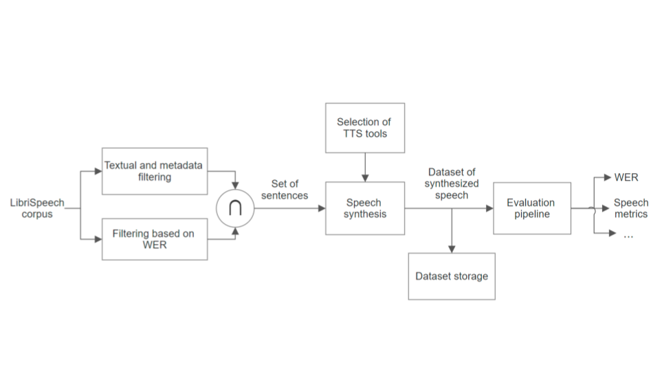

This code was written as part of a project to generate a dataset of synthetic speech that could be further used in fields of fake speech detection and similar. In this repository you can find the Python code to use the Text-To-Speech tools/APIs selected for the dataset generation, as well as 3 colabs notebooks:
- Dataset Creation - Main.ipynb contains all the pre-processing steps from LibriSpeech dataset to pick the textual sentences that would compose the dataset to be generated
- Dataset Evaluation - Main.ipynb contains a pipeline of evaluation metrics meant to characterise the different TTS tools used to generate the dataset
- Recurrent error and PER.ipynb contains a deeper more detailed study of the generated dataset through phonetics evaluation and words performances comparison

The (not published) paper written as a result of this project can be found at the following link:  
https://drive.google.com/file/d/1t1v75D9vgZvV2WAXCv5cyH3Br3NxaFQo/view?usp=sharing
(link to be updated)

More on this project:

In the diagram above you can have a more detailed overview of the pipeline of the project. 
- The first blocks on the left, corresponding to the generation of the "set of sentences", can be find in the first notebook (Dataset Creation).
- The "Speech synthesis" blocked was achieved using the code you can find in the "speech_synthesis_src" folder.
- The evaluation pipeline then corresponds to the two other python notebooks of the project.